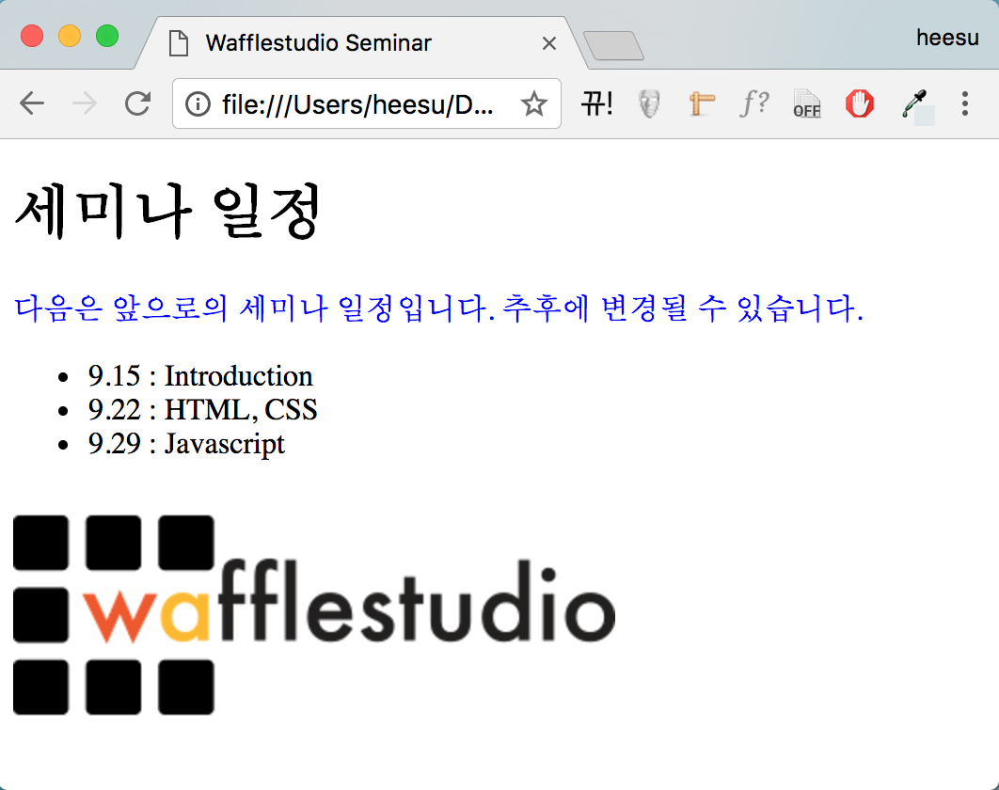
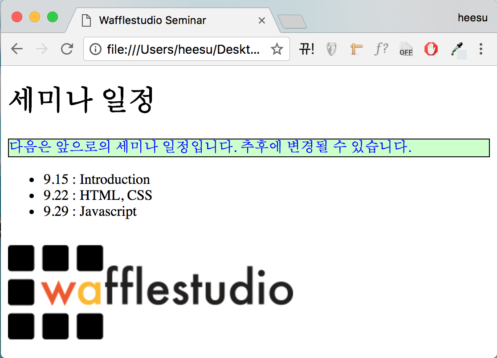
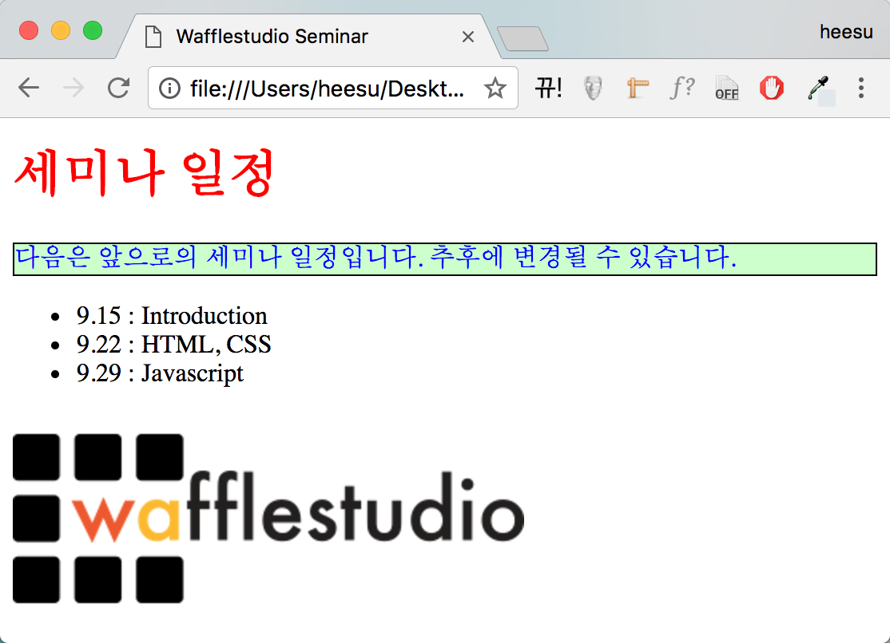
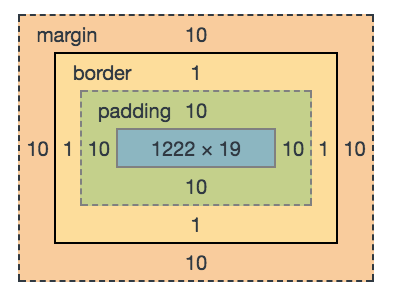
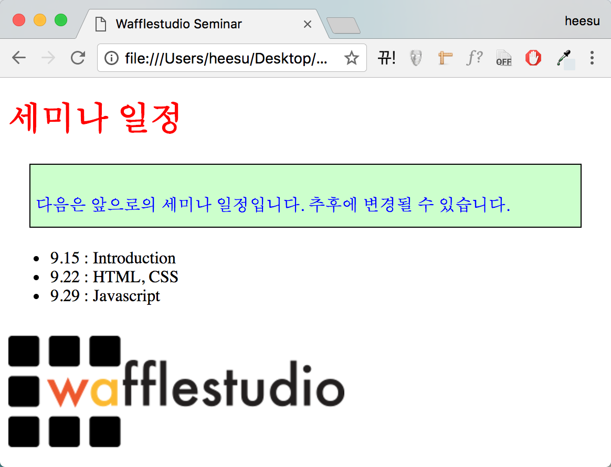
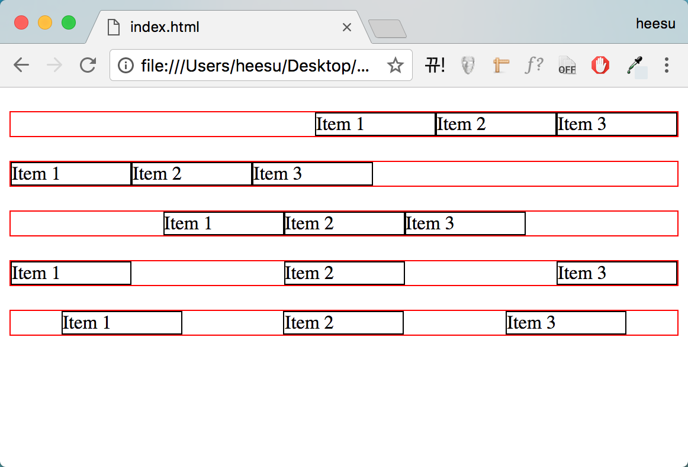
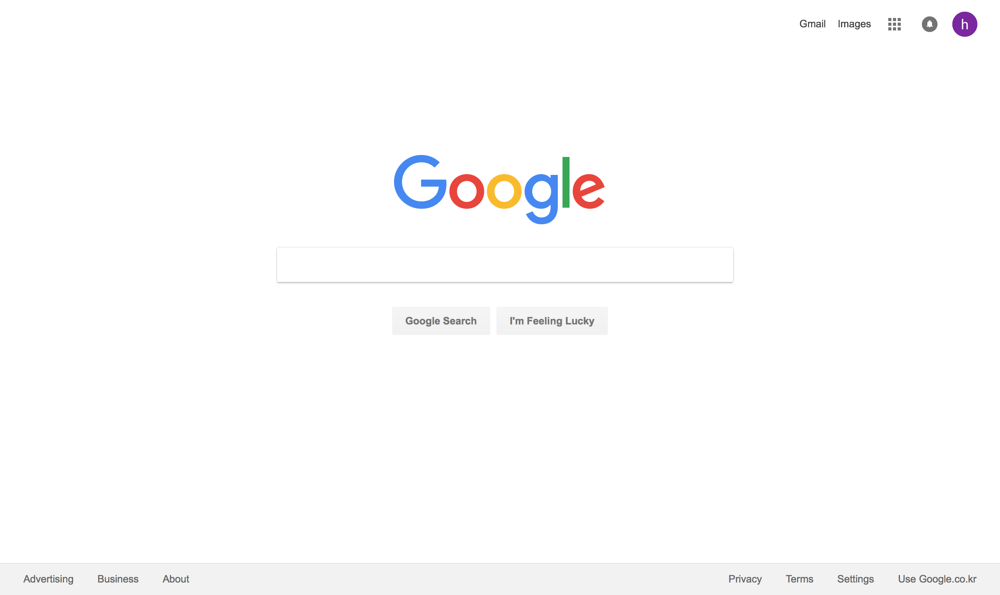

1. HTML & CSS
======================================

이번 세션에서는 웹 개발의 가장 기본이 되는 HTML과 CSS에 대해 다뤄볼 것입니다. 처음에는 어디서부터 공부해야될지 감이 잘 안 올 수도 있지만 열심히 구글링하면서 개발하다보면 어느샌가 숙련되어있는게 HTML과 CSS입니다... (화이팅)

HTML이 뭔가요?
--------------------------------------

HTML은 간단하게 설명하자면 웹 페이지가 어떤 구조로 만들어져있는지를 설명해주는 언어라고 할 수 있습니다. 예를 들어, 어떤 문서를 웹 페이지로 만든다고 했을 때 그 문서의 제목, 부제목은 무엇인지, 문단의 내용은 무엇인지, 혹은 어떤 이미지가 있는지에 대한 정보를 담고 있는 언어라고 할 수 있습니다.

HTML이 어떻게 생겼는지를 대충 보여드리면 아래와 같습니다. (곧 익숙해질 것입니다)

.. image:: ../_static/html-example.png
    :width: 100%

HTML의 구조를 파헤쳐봅시다
---------------------------------------

HTML은 여러 개의 element로 구성되어있습니다. 먼저 간단한 HTML element의 예시를 살펴봅시다.

.. code-block:: html

    
Wafflestudio

모든 element는 opening tag와 closing tag로 감싸져 있습니다. 여기서는 
가 opening tag, 
가 closing tag에 해당됩니다.

또한 element는 tag의 종류에 따라서 다른 의미를 가집니다. 여기서 사용하고 있는 것은 p tag이며 text paragraph를 의미합니다. html tag는 이 외에도 굉장히 많으며 대표적으로는 div(다른 html element들을 포함하는 container), a(어떤 웹페이지/이메일/url을 가리키는 하이퍼링크), input(유저가 텍스트를 입력할 수 있는 창), button(클릭할 수 있는 버튼) 등이 있습니다.

opening tag와 closing tag 안에 있는 것은 content라고 부르며, 여기서는 text로만 이루어져있습니다.

또한 element는 attribute들을 가지기도 합니다. attribute는 해당 element에 담겨있는 추가적인 정보를 의미합니다. attribute의 대표적인 예시로는 class나 id가 있는데 이것이 어떤 쓸모가 있는지는 조만간 알게 될 것입니다.

.. code-block:: html

    
Wafflestudio

element 안에 element를 넣을 수도 있습니다.

.. code-block:: html

    
와플스튜디오 <strong>세미나</strong>에 오신 것을 환영합니다.

어떤 element들은 content를 안 가지기도 합니다. 대표적으로는 img tag가 있습니다.

.. code-block:: html

    

조금 복잡한 구조를 살펴봅시다.

.. code-block:: html

    <html>
      <head>
        <meta charset="utf-8">
        <title>Wafflestudio Seminar</title>
      </head>
      <body>
        

            <h1>세미나 일정</h1>
            
다음은 앞으로의 세미나 일정입니다. 추후에 변경될 수 있습니다.

            <ul>
              <li>9.15 : Introduction</li>
              <li>9.22 : HTML, CSS</li>
              <li>9.29 : Javascript</li>
            </ul>
            
        

      </body>
    </html>

* <html> : html element. 웹페이지의 모든 것들을 담고 있는 element이며 root element라고 부르기도 함.
* <head> : head element. 유저에게 보여지는 content를 담고 있지는 않지만 웹페이지에 필요한 정보 등을 담고 있음.
* <body> : body element. 실제로 유저에게 보여지는 content를 담고 있음.
* <meta charset="utf-8"> : document가 사용하는 charcter set을 utf-8로 정의. 한글을 제대로 표시하려면 이것을 head에 포함해야함.
* <title> : 현재 페이지의 title. 보통 브라우저에서 탭에 띄워주는 문구.
* 
 : content를 div로 감싸고 있음.
* <h1> : heading 제목.
* 
 : paragraph.
* <ul> : bullet list.
* <li> : bullet list의 item
*  : image.

이 html 파일을 index.html로 저장하고 웹 브라우저에서 열면 다음과 같이 보일 것입니다. (이미지는 아무거나 넣고 img element에서 src를 그 파일명으로 수정해주시면 됩니다)

.. image:: ../_static/html-result-example.png
    :width: 100%
    :align: center

CSS가 뭔가요?
--------------------------------------

CSS는 HTML로 만든 웹페이지에 스타일을 씌워줘서 좀 더 보기 좋게 만들어주는 언어라고 생각하면 됩니다. 예를 들어, 어떤 글자의 색깔을 바꾸고 싶다던지, 폰트를 바꾸고 싶다던지, 혹은 이미지의 배치를 바꾸고 싶다던지 할 때 쓰는 언어입니다.

CSS 쓰는 법을 알아봅시다.
--------------------------------------

CSS를 쓰려면 일단 HTML에서 link를 해줘야 합니다. styles 폴더 안에 style.css라는 파일을 만들어서 html의 head tag 안에 다음 줄을 붙여넣어 봅시다. 참고로 href="styles/style.css"라고 한 것은 현재 경로를 기준으로 styles라는 폴더 안에 있는 style.css라는 파일을 의미합니다. 경로만 잘 설정해준다면 파일을 어디에 넣던지, 어떤 이름으로 만들어주던지 상관 없습니다.

.. code-block:: html

    <link href="styles/style.css" rel="stylesheet" type="text/css">

style.css에 다음 코드를 붙여넣어 봅시다.

.. code-block:: css

    p {
      color: blue;
    }

이제 index.html을 브라우저에서 열면 다음과 같이 보일 것입니다.

위에서 붙여넣은 코드에서 중괄호 앞에 있는 p는 p tag들에 해당 style을 적용한다는 것을 의미합니다.(selector라고 부름) 그리고 중괄호 안에 있는 color: blue는 p tag 안에 있는 text의 색깔을 blue로 지정해준다는 것을 의미합니다. (color는 property, blue는 property value라고 부름)

색깔 외에도 몇 가지 성질들을 더 추가해볼 수 있습니다.

.. code-block:: css

    p {
      color: blue;
      border: 1px solid black;
      background-color: #ccffcc;
    }

border: 1px solid black은 1px 크기의 검은색 경계선을 만든다는 의미이고, background-color: #ccffcc는 배경 색깔을 #ccffcc(색깔 hex code)로 만든다는 의미입니다. 이것을 브라우저에서 열면 다음과 같이 보입니다.

selector에는 tag selector 이외에도 여러 종류가 있는데, 대표적으로는 id selector와 class selector가 있습니다. 작업하던 html의 h1 tag에 다음과 같이 class를 추가해봅시다.

.. code-block:: html

    <h1 class="heading">세미나 일정</h1>

style.css에 다음과 같은 코드를 추가해봅시다. 이 코드는 heading이라는 class를 가진 element들의 color를 red로 만들어주는 것을 의미합니다. class selector는 class 이름 앞에 .을 붙이면 됩니다.(id selector는 앞에 #을 붙이면 됨)

.. code-block:: css

    .heading {
      color: red;
    }

이제 브라우저에서 띄우면 다음과 같이 보일 것입니다.

CSS box model에 대해 알아봅시다
--------------------------------------

앞에서는 CSS를 이용해 글자의 색깔, border의 색깔 등을 바꾸는 방법을 알아보았습니다. 그런데 element간의 간격이나 배치 등을 바꾸기 위해서는 어떻게 해야할까요? 그래서 필요한 것이 css box model입니다.

브라우저의 rendering engine은 모든 element를 직사각형 box로 취급합니다. 가장 안쪽에는 content area(실제 content가 들어있는 영역)가 있고, 그 밖에는 padding area(여백 영역), 그 다음에는 border area(경계선), 그리고 마지막으로 margin area(다른 element와 겹치지 않는 영역)가 있습니다.

실제로 style.css에 적용을 해봅시다. margin: 20px는 margin을 모두 20px로 준다는 의미이고, padding: 30px 5px 10px 5px(차례대로 top, right, down, left)은 위쪽 padding은 30px, 양옆 padding은 5px, 아래쪽 padding은 10px로 준다는 의미입니다.

.. code-block:: css

    p {
      color: blue;
      border: 1px solid black;
      background-color: #ccffcc;
      margin: 20px;
      padding: 30px 5px 10px 5px;
    }

이제 브라우저에서 띄우면 다음과 같이 보일 것입니다.

Flexbox (보충)
--------------------------------------

div element 여러 개를 앞쪽에 배치하고 싶다던지, 뒤쪽에 배치하고 싶다던지, 혹은 중간에 배치하고 싶을 때는 어떻게 할까요? 그래서 나온 것이 flexbox입니다.

그럼 flexbox를 이용한 간단한 예시를 살펴보겠습니다.

.. code-block:: html

  <html>
    <head>
      <meta charset="utf-8">
      <link href="style.css" rel="stylesheet" type="text/css">
    </head>
    <body>
      <!-- class="container container-1"은 container, container-1 class를 동시에 가지고 있는 것을 의미합니다.
      중간에 공백으로 구분해주면 이렇게 여러 개의 class를 넣을 수도 있습니다. -->
      

        
Item 1

        
Item 2

        
Item 3

      

      

        
Item 1

        
Item 2

        
Item 3

      

      

        
Item 1

        
Item 2

        
Item 3

      

      

        
Item 1

        
Item 2

        
Item 3

      

      

        
Item 1

        
Item 2

        
Item 3

      

    </body>
  </html>

.. code-block:: css

  .item {
    width: 100px;
    border: 1px solid black;
  }

  .container {
    margin: 20px 0px;
    border: 1px solid red;
    display: flex; /* 이렇게 display를 flex로 설정해주면 해당 element는 flex container가 됩니다. */
  }

  .container-1 {
    justify-content: flex-end; /* 뒤에부터 차곡차곡 쌓기 */
  }

  .container-2 {
    justify-content: flex-start; /* 처음부터 차곡차곡 쌓기 */
  }

  .container-3 {
    justify-content: center; /* 중간에 배치 */
  }

  .container-4 {
    justify-content: space-between; /* item 사이의 간격을 일정하게 */
  }

  .container-5 {
    justify-content: space-around; /* item 사이와 양 끝의 간격을 일정하게 */
  }

위의 html과 css를 각각 저장하고 브라우저에서 열어보면 다음과 같이 보일 것입니다.

이렇게 display: flex로 flex container를 만들어주고 justify-content를 적절히 설정해주면 원하는 레이아웃대로 배치할 수 있습니다. 한 번씩 시도해보시기 바랍니다.  flexbox를 더 자세히 알아보고 싶다면 아래 읽을거리에 첨부한 사이트들을 참고해주세요.

(IE 브라우저에서는 flexbox가 잘 작동하지 않을 수도 있습니다. 대응하는 방법도 있긴 하지만 많이 귀찮으니 Chrome이나 Edge 등 다른 브라우저를 사용하길 권장합니다)

읽을거리
--------------------------------------

* `생활코딩 HTML 사전 <https://opentutorials.org/course/1058>`_
* `생활코딩 CSS 사전 <https://opentutorials.org/course/718>`_
* `CSS Selector Reference <https://www.w3schools.com/cssref/css_selectors.asp>`_
* `How Flexbox works - explained with big, colorful, animated gifs <https://medium.freecodecamp.org/an-animated-guide-to-flexbox-d280cf6afc35>`_
* `FLEXBOX FROGGY (flexbox를 게임으로 배워봅시다) <http://flexboxfroggy.com>`_
* `CSS Layout - The position Property <https://www.w3schools.com/css/css_positioning.asp>`_

과제
--------------------------------------

HTML과 CSS만을 이용해서 구글 홈페이지 목업 만들기

필요한 이미지는 구글 홈페이지에서 직접 다운받을 수 있습니다.

과제를 하려면 세미나에서 다룬 내용 외에 직접 찾아보면서 공부해야할 것들도 좀 있을 것입니다. 위에 추가된 flexbox 보충자료와 읽을거리를 참고해주세요. (하단 바를 어떻게 구현해야할지 모르겠다면 CSS Layout - The position Property를 읽어보세요)