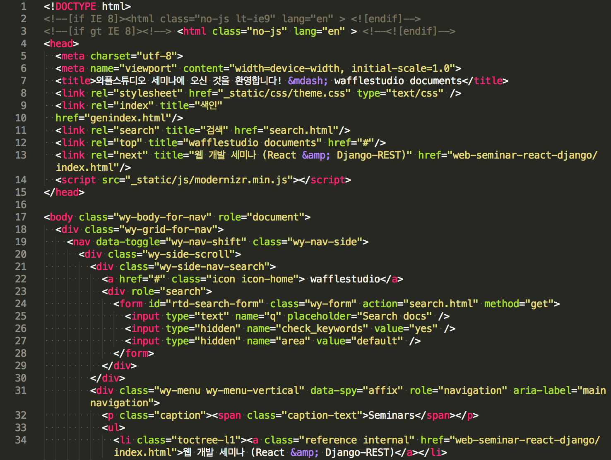
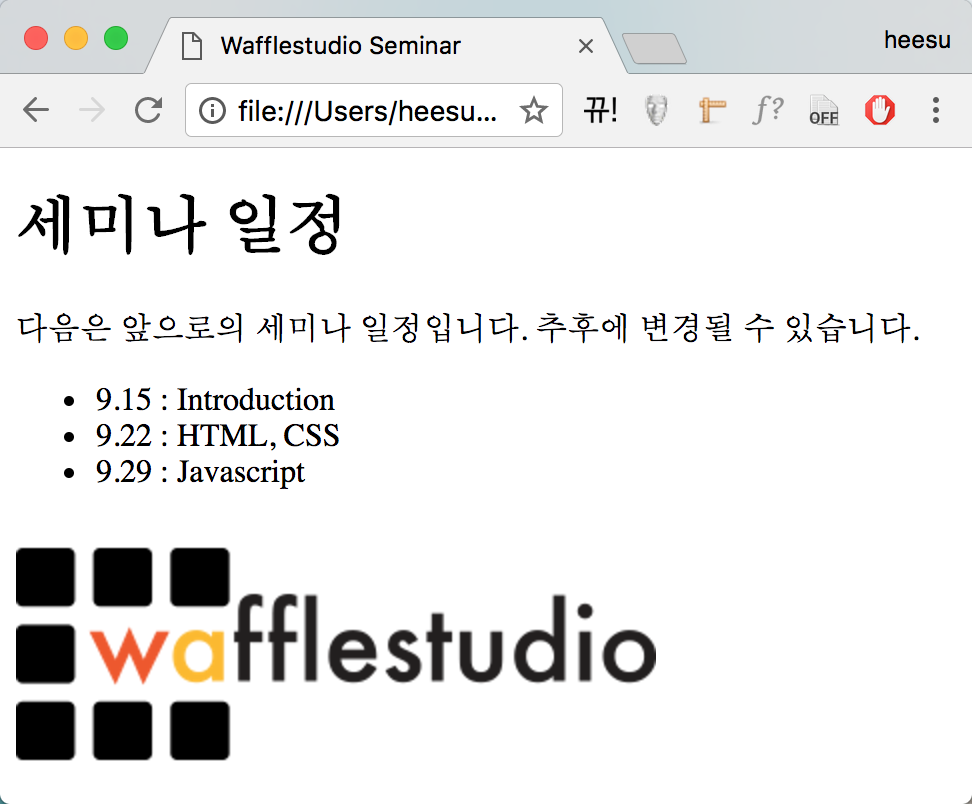

1. HTML & CSS
======================================

이번 세션에서는 웹 개발의 가장 기본이 되는 HTML과 CSS에 대해 다뤄볼 것입니다. 처음에는 어디서부터 공부해야될지 감이 잘 안 올 수도 있지만 열심히 구글링하면서 개발하다보면 어느샌가 숙련되어있는게 HTML과 CSS입니다... (화이팅)

HTML이 뭔가요?
--------------------------------------

HTML은 간단하게 설명하자면 웹 페이지가 어떤 구조로 만들어져있는지를 설명해주는 언어라고 할 수 있습니다. 예를 들어, 어떤 문서를 웹 페이지로 만든다고 했을 때 그 문서의 제목, 부제목은 무엇인지, 문단의 내용은 무엇인지, 혹은 어떤 이미지가 있는지에 대한 정보를 담고 있는 언어라고 할 수 있습니다.

HTML이 어떻게 생겼는지를 대충 보여드리면 아래와 같습니다. (곧 익숙해질 것입니다)

HTML의 구조를 파헤쳐봅시다
---------------------------------------

HTML은 여러 개의 element로 구성되어있습니다. 먼저 간단한 HTML element의 예시를 살펴봅시다.

.. code-block:: html

    
Wafflestudio

모든 element는 opening tag와 closing tag로 감싸져 있습니다. 여기서는 
가 opening tag, 
가 closing tag에 해당됩니다.

또한 element는 tag의 종류에 따라서 다른 의미를 가집니다. 여기서 사용하고 있는 것은 p tag이며 text paragraph를 의미합니다. html tag는 이 외에도 굉장히 많으며 대표적으로는 div(다른 html element들을 포함하는 container), a(어떤 웹페이지/이메일/url을 가리키는 하이퍼링크), input(유저가 텍스트를 입력할 수 있는 창), button(클릭할 수 있는 버튼) 등이 있습니다.

opening tag와 closing tag 안에 있는 것은 content라고 부르며, 여기서는 text로만 이루어져있습니다.

또한 element는 attribute들을 가지기도 합니다. attribute는 해당 element에 담겨있는 추가적인 정보를 의미합니다. attribute의 대표적인 예시로는 class나 id가 있는데 이것이 어떤 쓸모가 있는지는 조만간 알게 될 것입니다.

.. code-block:: html

    
Wafflestudio

element 안에 element를 넣을 수도 있습니다.

.. code-block:: html

    
와플스튜디오 <strong>세미나</strong>에 오신 것을 환영합니다.

어떤 element들은 content를 안 가지기도 합니다. 대표적으로는 img tag가 있습니다.

.. code-block:: html

    

조금 복잡한 구조를 살펴봅시다.

.. code-block:: html

    <html>
      <head>
        <meta charset="utf-8">
        <title>Wafflestudio Seminar</title>
      </head>
      <body>
        

            <h1>세미나 일정</h1>
            
다음은 앞으로의 세미나 일정입니다. 추후에 변경될 수 있습니다.

            <ul>
              <li>9.15 : Introduction</li>
              <li>9.22 : HTML, CSS</li>
              <li>9.29 : Javascript</li>
            </ul>
            
        

      </body>
    </html>

* <html> : html element. 웹페이지의 모든 것들을 담고 있는 element이며 root element라고 부르기도 함.
* <head> : head element. 유저에게 보여지는 content를 담고 있지는 않지만 웹페이지에 필요한 정보 등을 담고 있음.
* <body> : body element. 실제로 유저에게 보여지는 content를 담고 있음.
* <meta charset="utf-8"> : document가 사용하는 charcter set을 utf-8로 정의. 한글을 제대로 표시하려면 이것을 head에 포함해야함.
* <title> : 현재 페이지의 title. 보통 브라우저에서 탭에 띄워주는 문구.
* 
 : content를 div로 감싸고 있음.
* <h1> : heading 제목.
* 
 : paragraph.
* <ul> : bullet list.
* <li> : bullet list의 item
*  : image.

이 html 파일을 웹 브라우저에서 띄우면 다음과 같이 보입니다.

