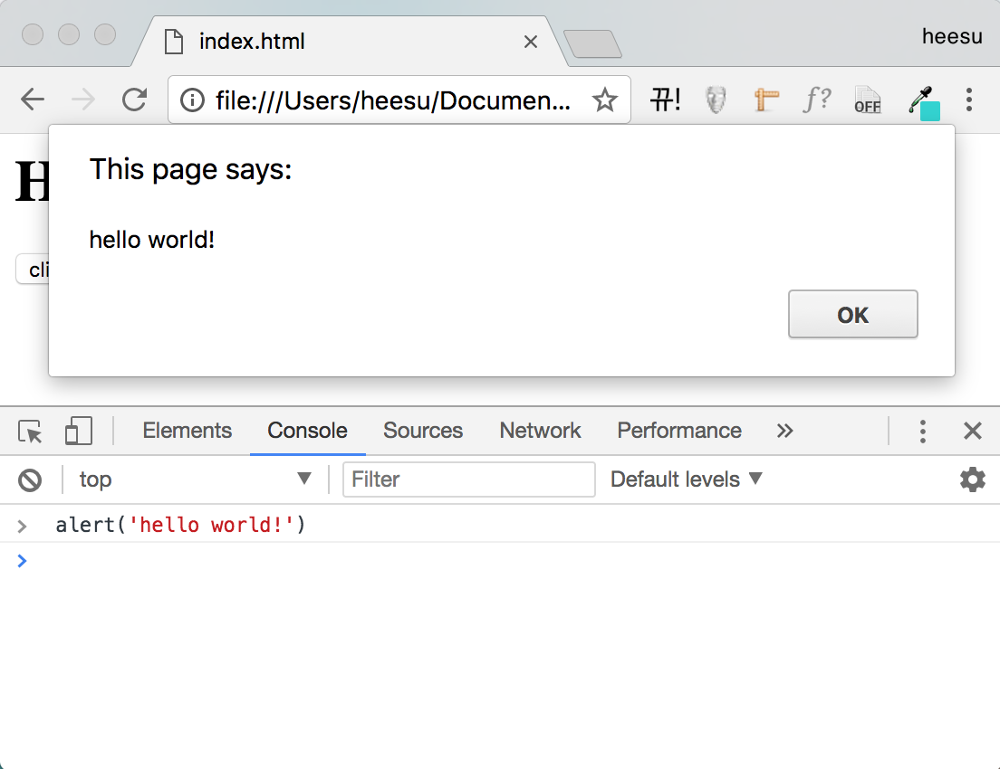

2. Javascript
======================================

이번 세션에서는 Javascript에 대해 다뤄볼 것입니다. 이미 하나 이상의 언어로 프로그래밍 경험이 있다고 생각하고 진행되기 때문에 아직 프로그래밍이 익숙하지 않은 분들은 따로 공부를 해주시길 바랍니다. (:ref:`programming-first` 참고)

Javascript가 뭔가요?
--------------------------------------

Javascript는 웹페이지에 좀 더 다이내믹한 기능을 제공하기 위해서 개발된 언어입니다. Javascript를 활용하면 유저로부터 인풋을 받아 필요한 작업을 수행할 수도 있고, 웹페이지를 더 다이내믹하게 만들 수도 있습니다. 웹앱을 개발하기 위해서는 필수적이라고 할 수 있습니다. 또한 최근에는 웹을 벗어나서 다양하게 사용이 되고 있는 추세이므로 배워두면 여러모로 쓸모가 있을 것입니다.

Hello World!
--------------------------------------

Javascript를 이용해 화면에 Hello World를 띄워봅시다.

.. code-block:: html

  <html>
    <head>
      <meta charset="utf-8">
    </head>
    <body>
      <h1 id="header"></h1>
      <!-- onClick의 value를 what()으로 넣어주면 click할 때 what 함수를 실행 -->
      <button onClick="what()">click!</button>
      <!-- 이렇게 script를 link해줘야 script가 실행됨. css를 link하는 것과 비슷.
      보통은 body tag가 끝나기 직전에 넣어주는 것이 좋음.
      그 이유는 더 앞쪽에서 넣어줄 경우 document가 다 로드되지 않아 스크립트에서 어떤 document 정보에 접근하지 못할 수도 있기 때문.-->
      
    </body>
  </html>

.. code-block:: javascript

  function what() { // what이라는 함수를 정의. 인자는 아무것도 받지 않음.
    var header = document.getElementById('header'); // header라는 id를 가진 element를 찾음
    header.textContent = 'Hello world!'; // header의 text content를 'Hello world'로 바꾼다.
  }

위의 html 파일을 index.html로 저장하고, 밑에 javasciprt 파일을 index.js로 같은 폴더에 저장하고 index.html을 브라우저에서 열어봅시다. 그리고 click 버튼을 눌러보면 아래 사진처럼 Hello World가 뜨는 것을 확인할 수 있을 것입니다.

무슨 일이 일어난 것인지 정리해보자면 다음과 같습니다. index.js가 실행이 되면서 what()이라는 함수를 정의했고, 이 함수가 하는 일은 header라는 id를 가진 element를 찾아 그 element의 내용을 \'Hello World!\'로 바꾸는 것입니다. 그리고 index.html에서는 button의 onClick attribute에 what()을 넣어줘서, button이 클릭되었을때 what()을 실행시킬 수 있도록 연결해주었습니다. 따라서 button을 누르면 what()이 실행되면서 h1 tag의 content를 \`Hello World!\`로 바꾼 것입니다.

개발자 도구 콘솔
--------------------------------------

개발자 도구의 콘솔에서도 Javascript를 실행할 수 있습니다. 콘솔 창을 열어서 alert('hello world!')를 입력하면 아래와 같이 경고창이 뜨는 것을 확인할 수 있을 것입니다.

타입과 연산자
--------------------------------------

Javascript에 있는 타입과 연산자들에 대해 알아봅시다.

Javascript는 다른 컴파일 언어와 다르게 어떤 변수가 어떤 타입의 데이터를 가지고 있는지 정해져있지 않습니다. 그냥 코드가 실행될 때 타입이 결정됩니다. 이를 dynamic typing이라고 부르기도 합니다. 변수를 정의하는 방법에는 다음과 같은 것들이 있습니다. (let과 const는 최근 표준이라 몇몇 브라우저에서는 아직 작동하지 않을 수도 있습니다.)

.. code-block:: javascript

  var a // 이렇게 정의하면 스크립트가 실행되기 전에 미리 변수 a가 정의됨. hoisting이라고 부름.
  let a // block 안에서만 사용할 수 있게 scoping 됨.
  const a // let과 마찬가지로 block scoping이 되지만 다시 대입하는걸 방지함.

Javascript의 기본 타입(primitive type)에는 다음과 같은 것들이 있습니다.

* undefined : 값이 정의되지 않았음을 의미합니다. (변수를 정의하기만 하고 값을 넣어주지 않으면 undefined가 뜹니다)
* null : 값이 없음을 의미합니다. (값이 없다는 의미를 표현하고 싶을 때는 웬만하면 undefined보다는 null을 씁시다)
* boolean : true 혹은 false
* number : 정수, 소수 구분없이 모든 숫자는 number type (ex. 1, 2, 5.4 등등)
* string : 문자열 (ex. 'hello', 'world' 등등)

연산자들에는 다음과 같은 것들이 있습니다. 각자 콘솔에서 이것저것 시험해보시기 바랍니다.

.. code-block:: javascript

  6 + 9 // 15
  "Hello " + "world!" // "Hello world!"
  9 - 3 // 6
  8 * 2 // 16
  9 / 3 // 3
  var a = 3 // a에 3을 대입
  3 === 4 // false
  "hello" === "hello" // true
  !(false) // true
  3 !== 4 // true
  true && true // true
  true && false // false
  true || false // true

**Coercion** : 연산을 할 때 type이 알아서 바뀌기도 합니다. 유독 Javascript에서는 독특한 특징도 많고 자주 쓰이니 알아두면 좋을 것입니다.

.. code-block:: javascript

  1 + "2" // "12"
  false == 0 // true
  "" == 0 // true
  null == undefined // true

**== vs ===** : ===는 좀 더 strict하게 equality를 체크하는 연산자입니다. ===로 체크하면 coercion이 일어나지 않습니다. coercion을 의도한게 아니라면 항상 ===를 쓰도록 합시다!

조건문과 반복문
------------------

조건문과 반복문은 다른 언어와 비슷하니 `조건문 - 생활코딩 <https://opentutorials.org/course/743/4724>`_\과 `반복문 - 생활코딩 <https://opentutorials.org/course/743/4728>`_\를 참고하시기 바랍니다.

객체(Object)
----------------

Javascript에서 Object는 name/value pair로 이루어져있습니다.

.. code-block:: javascript

  var tony = {
    firstname: 'Tony', // firstname이라는 name에 'Tony'라는 value
    lastname: 'Alicea',
    address: { // object를 value로 가질 수도 있음.
      street: '111 Main St.',
      city: 'New York',
      state: 'NY'
    }
  };

  console.log(tony.firstname) // 'Tony'
  console.log(tony.address.street) // '111 Main St.'
  console.log(tony['firstname']) // 'Tony'

  tony.lastname = 'Suh' // 이렇게 값을 대입할 수도 있음
  console.log(tony.lastname) // 'Suh'

  tony['lastname'] = 'Kim'
  console.log(tony.lastname) // 'Kim'

  tony.age = 20 // 이렇게 새로운 값을 넣어줄 수도 있음
  console.log(tony.age) // 20

  function greet(person) {
    console.log('Hi ' + person.firstname);
  }

  greet(tony) // 'Hi Tony'

**JSON** : JavaScript Object Notation. Javascript object를 문자열(string)으로 만든 것으로 서버와 데이터를 주고 받을 때 자주 쓰는 형태입니다.

.. code-block:: javascript

  var obj = JSON.parse('{ "firstname": "Mary", "isAProgrammer": true }')
  console.log(obj)
  console.log(JSON.stringify(obj))

함수(Function)
-------------------

Javascript에서 함수는 객체로 취급됩니다. 그래서 함수를 변수(variable)에 대입할 수도 있고, 다른 함수에 인자로 전달해줄 수도 있고, 어디서든지 만들 수도 있습니다. 이러한 성질을 first class function이라고 부릅니다.

**Statement vs Expression** : statement는 어떤 작업을 수행하라는 명령문이고 expression은 결과값이 나오는 코드 단위를 의미합니다. (ex. a = 3 은 expression, if (a == 3) {} 는 statement)

.. code-block:: javascript

  greet();

  // function statement
  function greet() {
      console.log('hi');
  }

  // function expression
  var anonymousGreet = function() { // anonymous function
      console.log('hi');
  }

  anonymousGreet();

  function log(a) {
     a();
  }

  log(function() {
      console.log('hi');
  });

**By Value vs By Reference** :

* b = a에서 a가 primitive value이면, b는 그 primitive value의 copy를 가리키게 된다(by value)
* b = a에서 a가 object나 function이면, b는 a가 가리키고 있던 object를 가리키게 된다(by reference)

**Immediately Invoked Function Expressions** :

.. code-block:: javascript

  var greeting = function(name) {
    return 'Hello ' + name;
  }('John'); // 함수를 만들고 바로 실행

  console.log(greeting); // result : Hello John

Closure
----------------

Javascript는 함수 안에서 함수를 정의할 수도 있습니다.

.. code-block:: javascript

  function a() { // 외부 함수 (outer function)
    var name = 'Heesu';

    function greet() { // 내부 함수 (inner function)
      console.log('Hello, ' + name);
    }

    greet();
  }

  a(); // Hello, Heesu

내부 함수는 외부 함수에서 선언된 변수들에 접근할 수 있습니다. 그래서 greet에서 name 변수에 접근할 수 있는 것입니다.

그럼 다음 예제를 살펴봅시다.

.. code-block:: javascript

  function makeGreet(name) { // 함수를 만들어 리턴하는 함수
    return function greet() {
      console.log('Hello, ' + name);
    }
  }

  var greetHeesu = makeGreet('Heesu'); // greetHeesu는 함수
  var greetDonghoon = makeGreet('Donghoon');
  greetHeesu(); // Hello, Heesu
  greetDonghoon(); // Hello, Donghoon

greetHeesu와 greetDonghoon은 makeGreet에서 만들어진 함수들입니다. greetHeesu는 makeGreet에 'Heesu'를 인자로 넘겨서 나온 함수이고, greetDonghoon은 makeGreet에 'Donghoon'을 인자로 넘겨서 나온 함수입니다. 그런데 언뜻보면 정말 이상합니다. makeGreet 함수의 실행이 끝나고 나면 name 변수에는 더 이상 접근 못하는게 당연할 것 같은데, 어떻게 greetHeesu랑 greetDonghoon은 이전에 전달해준 name variable에 접근할 수 있는 걸까요?

이러한 성질을 Closure라고 부릅니다. 함수 안에서 함수를 정의하면 내부함수는 외부함수의 실행이 끝나고 나서도 외부함수의 변수에 접근할 수 있습니다. 그러니까 makeGreet에서 정의된 name 변수는 어딘가에 남아있어서, greetHeesu에서는 'Heesu'값을 가진 name 변수에 접근할 수 있고, greetDonghoon은 'Donghoon'값을 가진 name 변수에 접근할 수 있는 것입니다.

다음은 Closure를 이용한 다른 예시입니다.

.. code-block:: javascript

  function makeGreeting(language) {

    return function(name) {
      if (language === 'en') {
        console.log('Hello ' + name);
      }

      if (language === 'ko') {
        console.log(name + '님 안녕하세요 ');
      }
    }
  }

  var greetEnglish = makeGreeting('en');
  var greetKorean = makeGreeting('ko');

  greetEnglish('Heesu Suh');
  greetKorean('서희수');

읽을거리
--------------
* `Learning Functional Programming with JavaScript <https://youtu.be/e-5obm1G_FY>`_