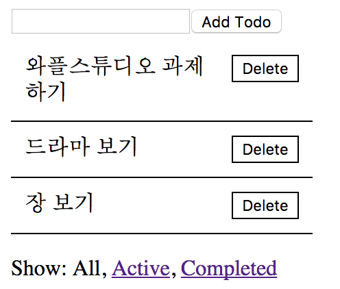
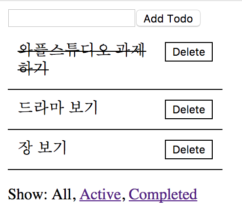
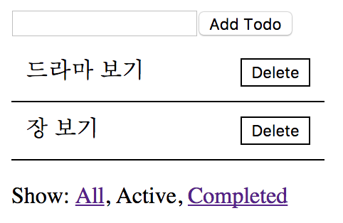
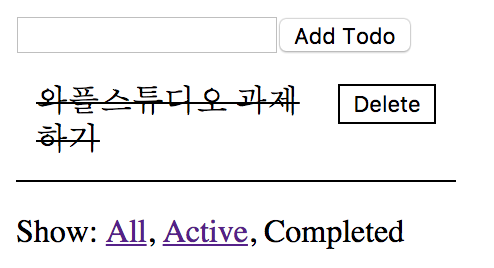
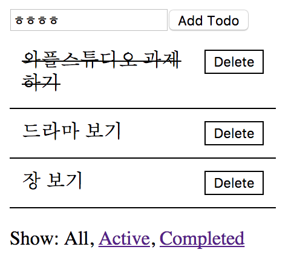
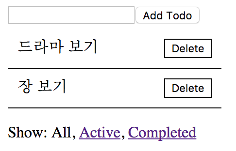

3. React
======================================

이번 세션에서는 React라는 라이브러리(`라이브러리란? <https://youtu.be/3mBUrrsGpPU>`_)에 대해 다뤄볼 것입니다. 요새 현업에서 많이 쓰이는 핫한 라이브러리입니다.

React같은 라이브러리를 왜 써야하나요?
---------------------------------------

간단한 웹앱의 경우에는 굳이 라이브러리를 쓰지 않아도 쉽게 개발할 수 있습니다. 하지만 좀만 복잡해지면 React와 같은 라이브러리 없이 개발하는 것은 굉장히 고통스러운 일이 됩니다.

페이스북 댓글창 같은 기능을 생각해봅시다. 어떤 유저가 새로운 댓글을 남기거나, 댓글 더 보기를 누르거나, 혹은 댓글을 숨기거나 하면 댓글창의 View를 업데이트해줘야합니다. 그런데 이걸 appendChild나 removeChild 같은 함수를 이용해서 일일이 해줘야 한다면 개발 시간도 더 오래 걸리고, 코드 관리도 어려워질 것입니다. 거기다가 새로운 기능을 구현하려 한다면 또 그에 맞게 View를 업데이트해주는 함수를 만들어야 하니 규모가 커지면 커질수록 이는 고통스러운 일이 될 것입니다. 그래서 이렇게 View를 업데이트하는 일을 훨씬 간단하게 만들어주고자 React와 같은 라이브러리가 등장한 것입니다.

React 외에도 비슷한 일을 해주는 라이브러리/프레임워크로는 Angular나 Vue 등이 있습니다. 이 라이브러리/프레임워크들 간의 비교는 구글링해보면 많은 자료들이 나오니 궁금하신 분들은 찾아서 보시기 바랍니다.

개발 환경 세팅
-------------------

1. `Node.js <https://nodejs.org/en/>`_ 최신버전을 설치합니다.
2. `Create React App <https://github.com/facebookincubator/create-react-app#quick-overview>`_\으로 새로운 React App을 만듭니다.

ES6
---------------

ES6는 Javascript의 새로운 표준을 말합니다. 기존 표준에 비해 새로운 문법들이 많이 추가되었습니다. 앞으로 ES6의 문법을 많이 사용할 예정입니다. ES6의 새로운 문법에 대해서는 `Top 10 ES6 Features Every Busy JavaScript Developer Must Know <https://webapplog.com/es6/>`_\에 잘 정리되어있으니 참고하시기 바랍니다.

React 기본 개념 : Component
-----------------------------------------------

Create React App을 이용해 만든 App의 src/App.js 파일을 열어봅시다.

.. code-block:: jsx

  import React from 'react';
  import logo from './logo.svg';
  import './App.css';

  class App extends React.Component {
    render() {
      return (
        

          <header className="App-header">
            
            <h1 className="App-title">Welcome to React</h1>
          </header>
          

            To get started, edit <code>src/App.js</code> and save to reload.
          

        

      );
    }
  }

  export default App;

React에서는 View를 Component단위로 관리합니다. 재사용 가능한 Component로 나눔으로써 코드의 반복도 줄일 수 있고, 또한 특정 기능을 단위로 Component로 나눔으로써 관심사 분리(separation of concern)를 이루어 코드를 좀 더 체계적으로 관리할 수 있게 됩니다.

모든 React Component들은 React.Component를 상속합니다. 그리고 반드시 render 함수를 오버라이딩해야합니다. 이 render 함수는 화면에 어떤 것을 보여줄지를 알려주는 역할을 합니다. React에서는 이 render 함수를 이용해 화면에 어떻게 보여질지를 계산하고 필요한 부분만 효과적으로 업데이트합니다.

React에서는 보통 JSX라는 확장된 문법을 사용합니다.(위에 render 함수 안에서 사용한 문법) 이 문법은 HTML과 비슷하지만 그 안에 Javascript Code를 넣을 수 있는 등 더 다양한 일을 할 수 있습니다. 사용법은 차차 알아보도록 합시다.

React 기본 개념 : State
-----------------------------------------------

React에서 가장 중요한 기능은 데이터 바인딩(데이터를 업데이트하면 View를 알아서 업데이트)이라고 할 수 있습니다. 이 데이터는 Component의 State 안에 저장될 수도 있고, 부모 Component에서 Props로 전달받을 수도 있습니다. 먼저 State에 대해 알아봅시다.

App.js 파일을 다음과 같이 수정해봅시다.

.. code-block:: jsx

  import React from 'react';

  class App extends React.Component {
    constructor(props) {
        super(props);

        this.state = { // 이렇게 state를 정의합니다.
            count: 0,
        };

        this.handleClick = this.handleClick.bind(this); // handleClick 함수 안에서 this가 이 Class를 가리키도록 하려면 bind(this)를 해줘야 합니다.
    }

    handleClick() {
        this.setState({ // setState를 통해 state 값을 업데이트합니다.
           count: this.state.count + 1,
        });
    }

    render() {
      return (
        

            <button onClick={this.handleClick} >click!</button>
            
{this.state.count}

        

      );
    }
  }

  export default App;

State는 단어 그대로 Component의 상태를 나타낸다고 생각하면 됩니다. State를 사용하려면 constructor에서 this.state로 정의를 해주고, 값을 업데이트하려면 this.setState 함수를 이용하면 됩니다. 위에서는 count 값을 1 증가시키는 handleClick이라는 함수를 만들어서 button의 onClick에 넣어주었습니다. (JSX에서는 {} 안에 Javascript Expression을 사용할 수 있습니다) 그리고 p tag 안에 this.state.count 값을 출력하도록 하였습니다. 브라우저에서 띄워보고 click 버튼을 눌러보세요.

React 기본 개념 : Props
-----------------------------------------------

Component가 많아지고 점점 구조가 복잡해질수록 상위 Component에서 데이터를 관리해야할 필요를 느낄 것입니다. 그 데이터가 하나의 Component에서만 쓰이는 게 아니라 여러 Component에서 쓰일 때 그렇죠. 그러면 상위 Component에서 데이터를 관리한다고 했을 때 그것을 하위 Component로 전달하려면 어떻게 해야할까요? 그 때 사용하는게 Props입니다.

src 폴더에 Comment.js라는 파일을 만들어서 다음 코드를 붙여넣어 봅시다.

.. code-block:: jsx

  import React from 'react';

  class Comment extends React.Component {
    render() {
      return (
        

          
          

            
{this.props.name}

            
{this.props.text}

          

        

      );
    }
  }

  export default Comment;

그리고 App.js 파일을 다음과 같이 수정해봅시다.

.. code-block:: jsx

  import React from 'react';
  import Comment from './Comment';

  class App extends React.Component {
    render() {
      return (
        

          <Comment avatarUrl={'http://via.placeholder.com/50x50'} name={'Mark Zuckerberg'} text={'I want Instagram'} />
          <Comment avatarUrl={'http://via.placeholder.com/50x50'} name={'Elon Musk'} text={'Then buy it'} />
        

      );
    }
  }

  export default App;

위에 App.js 파일에서도 볼 수 있듯이 Component 안에서 Component를 사용할 수 있습니다.(Comment.js 파일에서 Comment Component를 import해서 사용) 그리고 Comment Component에 avatarUrl, name, text라는 prop들을 전달해주고 Comment Component에서 그것을 this.props로 받아서 쓰고 있는 것을 볼 수 있습니다.

아래 코드는 이 데이터를 상위 컴포넌트에서 state로 관리하고 있는 예시입니다.

.. code-block:: jsx

  import React from 'react';
  import Comment from './Comment';

  class App extends React.Component {
    constructor(props) {
      super(props);

      this.state = {
        comments: [
          {
            writer: {
              name: 'Mark Zuckerberg',
              avatarUrl: 'http://via.placeholder.com/50x50',
            },
            text: 'I want Instagram',
          }, {
            writer: {
              name: 'Elon Musk',
              avatarUrl: 'http://via.placeholder.com/50x50',
            },
            text: 'Then buy it',
          }
        ]
      }
    }

    render() {
      return (
        

          {
            this.state.comments.map((comment, index) => (
              <Comment key={index} avatarUrl={comment.writer.avatarUrl} name={comment.writer.name} text={comment.text} />
            ))
          }
        

      );
    }
  }

  export default App;

map 함수에 대해서는 `Array.prototype.map() - MDN <https://developer.mozilla.org/en-US/docs/Web/JavaScript/Reference/Global_Objects/Array/map>`_\을 참고하세요.

React Tutorial : Tic Tac Toe
--------------------------------

기본적인 개념들을 살펴보았으니 이제 `React 공식 튜토리얼 <https://reactjs.org/tutorial/tutorial.html#getting-started>`_\을 따라가면서 더 알아보도록 합시다.

기본 뼈대 코드는 `<https://www.dropbox.com/s/ywaw6xo5z8jkdwq/tic-tac-toe.zip?dl=0>`_ 에 올려놓았으니 참고하시기 바랍니다.

세미나에서는 Storing a History 전까지만 다룰 예정이지만, 그 이후 내용도 혼자서 해보시면 좋을 것 같습니다.

과제
-----------------

간단한 To-Do List 만들기

기본 화면은 아래와 같이 생겼습니다.

아이템을 클릭하면 아래와 같이 완료되었다는 표시를 해줍니다.

Show: 에서 Active를 클릭하면 아직 완료되지 않은 아이템들만을 보여줍니다.

Show: 에서 Completed를 클릭하면 완료된 아이템들만을 보여줍니다.

인풋창에 텍스트를 입력하고 Add Todo 버튼을 누르면 새로운 아이템을 추가해줍니다.

Delete 버튼을 누르면 아이템을 삭제해줍니다.

읽을거리
----------------

* `State and Lifecycle <https://reactjs.org/docs/state-and-lifecycle.html>`_
* `Conditional Rendering <https://reactjs.org/docs/conditional-rendering.html>`_
* `Forms <https://reactjs.org/docs/forms.html>`_
* `Thinking in React <https://reactjs.org/docs/thinking-in-react.html>`_