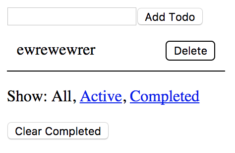

4. Redux & Redux-saga
======================================

이번 세션에서는 Redux라는 라이브러리에 대해 다뤄볼 것입니다.

세미나 진행은 공식 튜토리얼을 따라가면서 할 예정입니다. 자료는 `공식 홈페이지 <https://redux.js.org>`_\를 참고해주세요. (한글 번역판도 있습니다. `참고 <https://deminoth.github.io/redux/>`_)

과제
------------

저번에 과제로 만들었던 To-Do List를 Redux를 이용해서 만들어봅시다. 그리고 추가로 '완료된 항목 삭제' 기능을 만들어봅시다.

아래 화면에서 Clear Completed 버튼을 누르면 완료된 항목들을 삭제해주면 됩니다.

심심하면 기능도 더 추가하고 디자인도 바꿔보세요.

읽을거리
----------------
* `Connecting Redux to your API <https://engineering.haus.com/connecting-redux-to-your-api-eac51ad9ff89>`_
* `10 Tips for Better Redux Architecture <https://medium.com/javascript-scene/10-tips-for-better-redux-architecture-69250425af44>`_